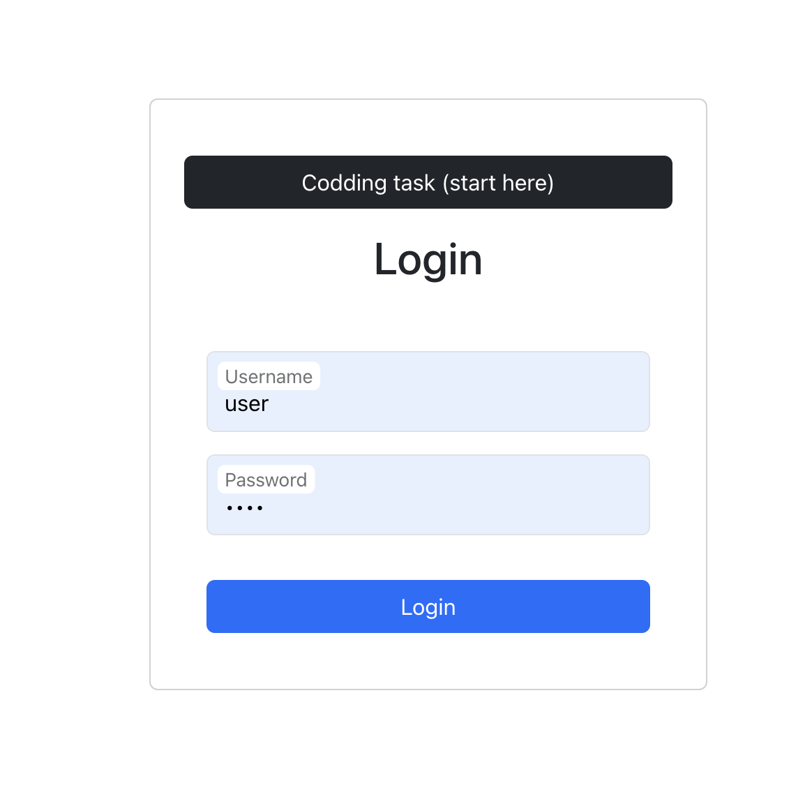
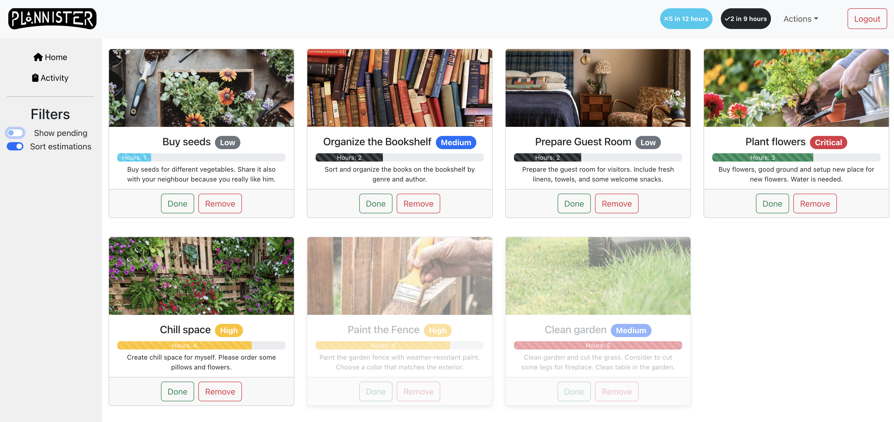

# QA Recruitment Task

### Prerequisites

- [Node.js](https://nodejs.org/) (tested on v18.16.0)
- [npm](https://www.npmjs.com/) (Usually comes with Node.js)

### Installing

First, clone the repository to your local machine and install the necessary dependencies:

```bash
npm install
```

To start the application run:

```bash
npm start
```
This will start the React app and automatically open it in your default web browser. If it doesn't open automatically, you can manually access it by visiting [http://localhost:3000](http://localhost:3000) in your browser.

## List of features:

This section present list of features that application contains for better understand how the application was shaped.

### 1. Login Page
- Simple login mechanism (credentials are hardcoded: user/pass)

### 2. Home Page

After successful login, users are directed to the home page with features:

#### List of Items

- Displaying tasks with details such as title, description, priority, estimate

#### Task Management Buttons:
- `Done` - marks the task as complete and inactive
- `Remove` - deletes the task from the list


### 3. Side Menu

Includes two main components, links to pages and filters:

- `Home` - base page of the application with the task list
- `Activity` - page displaying a table of activities within the application
- `Show Pending` - displays only incomplete tasks
- `Sort Estimation` - orders tasks based on their estimated completion time.

### 4. Activity Page
   
Tracks changes in task status, new task creation, task completion, and removal.

Table interactivity:
- Sorting capability
- Search functionality based on task title and action

### 5.Header Features

- Task Summary Badges - displaying the total number of incomplete and completed tasks
- Time Tracking - Shows the time taken to complete tasks and the estimated time to finish all active tasks
- Dropdown 'Actions' Button - allows users to add new task

### 6. Task Creation Modal

Triggered by the `Add` button in the header, providing input fields with validation such as:

- Title (max 25 characters)
- Description (max 100 characters)
- Priority (low, medium, high, critical)
- Estimate (integer, with a color-coded progress bar)
- Image URL (linking to an external image)

### 7. Logout Functionality
Allows users to securely log out of the application.

## Screenshots

